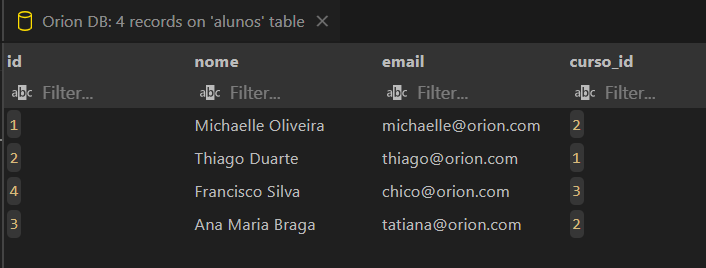
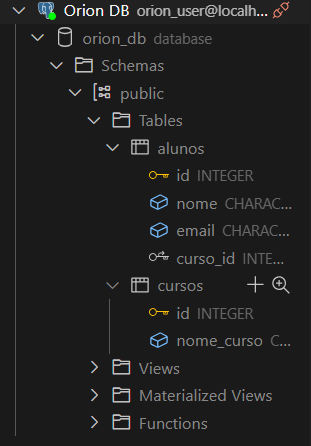
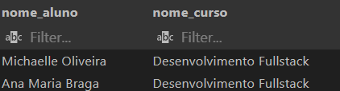
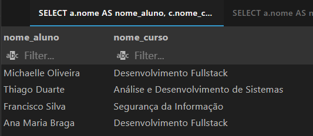
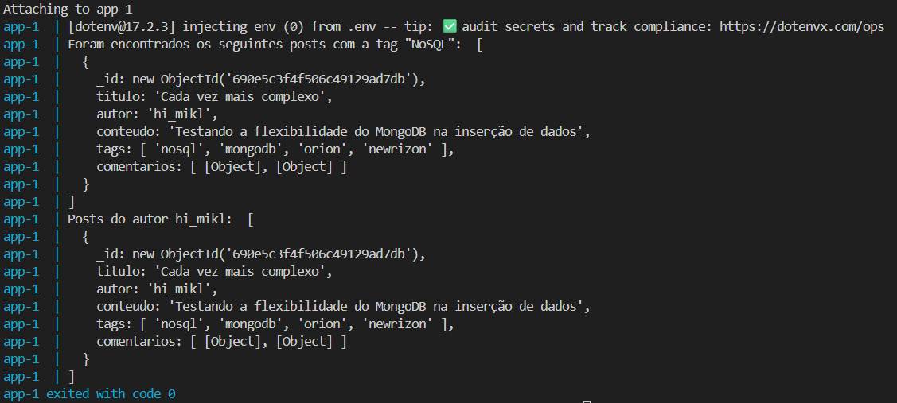
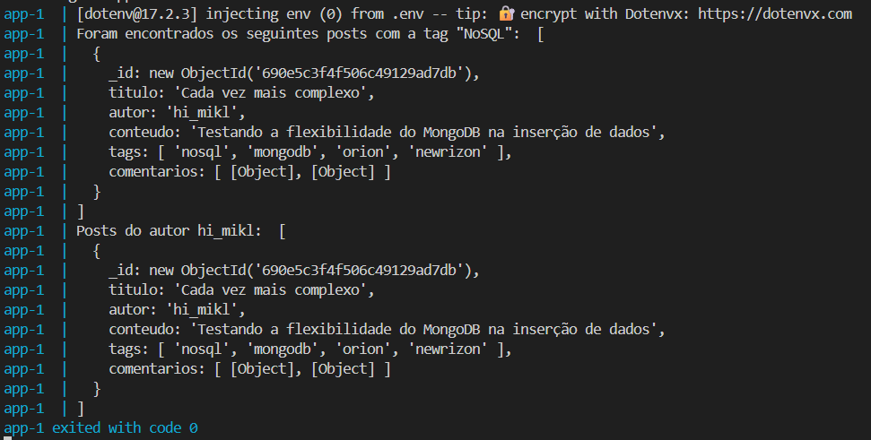

# Orion Bootcamp

## 🐋 Docker

Este projeto tem como objetivo praticar boas práticas de build e configuração de ambientes de desenvolvimento e produção usando Docker.

Ele inclui:

- API em Node.js com Express
- Banco de dados PostgreSQL
- Ambientes isolados: dev com live reload e prod otimizado

## 🏦 DataBase

Este projeto tem como objetivo praticar conceitos de bancos de dados SQL (PostgreSQL) e NoSQL (MongoDB), explorando desde a criação de tabelas e consultas básicas até o uso de estruturas flexíveis e consultas avançadas.

- Ele inclui:
  - Banco relacional (PostgreSQL) — com criação de tabelas, chaves estrangeiras e consultas com JOIN e filtros.
  - Banco não relacional (MongoDB) — com coleções, documentos, arrays e consultas filtradas.
  - Configuração de ambiente com Docker Compose, permitindo iniciar ambos os bancos simultaneamente.
  - Arquivos separados para ambientes de desenvolvimento e produção, aplicando boas práticas de versionamento e estruturação.

### SQL

1. Exibindo banco de dados

  

2. Mostrando as tabelas criadas

  

3. Filtro de alunos no mesmo curso

  

4. Filtro de todos os alunos com seus respectivos cursos

  

---

### NoSQL

1. Demonstração de filtro no ambiente de desenvolvimento

  

2. Demonstração de filtro no ambiente de produção

  

